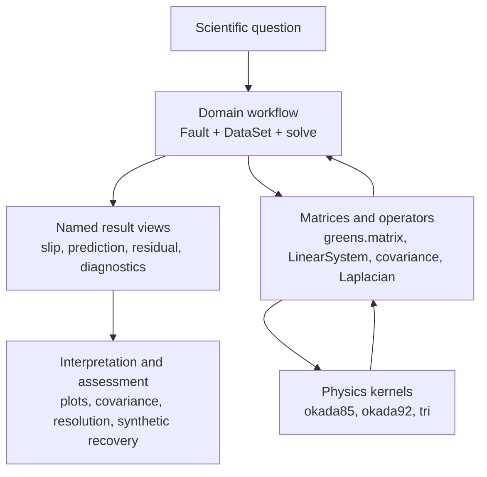

# GeoDef workflow map and decision guides

Use this page to choose an API level and route scientific decisions to the
relevant tutorial. It deliberately does not replace the method explanations.
Terms and symbols link to the [glossary](glossary.md); physical conventions are
defined in [conventions](conventions.md).

## Three levels of API

Start at the domain level unless the question itself is about a matrix,
operator, kernel, or repeated expert computation.

| Level | Use it when | Primary entry points | Course |
|---|---|---|---|
| Domain workflow | Building a forward model or estimating slip | `Fault`, `data.*`, `solve`, named result views | 01, 03–08 |
| Matrices/operators | Inspecting ordering, custom priors, repeated sweeps, or diagnostics | `greens.matrix`, `invert.LinearSystem`, `invert.model_*` | 02–04, 08 |
| Physics kernels | Validating a formulation or needing displacement/strain features below `Fault` | `okada`, `okada85`, `okada92`, `tri` | 01, 11 |

The [quickstart](quickstart.md) stays entirely at the domain level. Tutorials 01
and 02 deliberately descend into the other levels so the abstraction remains
transparent.

## Which geometry path?

| Scientific situation | Use | Assumption you are making | Learn more |
|---|---|---|---|
| One planar rectangular fault | `Fault.planar(...)` | One strike and dip; rectangular Okada sources | 01–02 |
| Curved or complex fault surface | `Fault.from_triangles(...)` or `Fault.from_mesh(...)` | Piecewise planar triangular sources | 11 |
| Unknown planar geometry | `invert.geometry_search(...)` | Chosen bounds and objective capture plausible geometry | 09–10 |
| Geometry uncertainty matters | `bayes.RectPosterior` or `TriPosterior` | Explicit priors and likelihood are defensible | 14 |

Declare a `LocalFrame` when local arrays from different sources must share one
origin. Never combine local coordinates whose frames differ silently.

## Which slip basis?

| Goal | `components=` | Additional input | Assumption |
|---|---|---|---|
| Let both physical components vary | `"both"` | none | Strike and dip slip are independently estimable. |
| One physical component | `"strike"` or `"dip"` | none | The orthogonal component is exactly zero. |
| One fixed local direction | `"rake"` | `rake=` | Every patch shares one rake; best for uniform strike. |
| One fixed geographic direction | `"azimuth"` | `slip_azimuth=` | Horizontal direction is common across variable strike. |
| Plate-motion coordinates | `"plate"` | `plate_rake=` | Plate-parallel/perpendicular directions are the meaningful basis. |

Use named result views (`strike_slip`, `dip_slip`, `slip_magnitude`) for
interpretation. Use blocked `slip_vector` only when working with $G$ directly.
Tutorial 07 develops bases and constraints.

## Which regularization?

| Need | Use | Assumption | Learn more |
|---|---|---|---|
| No quadratic prior | `regularization=None` | Data alone identify a useful model. Often false for distributed slip. | 03 |
| Spatially smooth slip | `"laplacian"` | Curvature should be small in the chosen patch/basis coordinates. | 04 |
| Small model magnitude | `"damping"` | A minimum-norm model is preferred. | 04 |
| Stress-based penalty | `"stresskernel"` | The chosen elastic interaction measure is the relevant prior. | 04 |
| Custom scientific prior | array operator | The supplied $L$ and its null space express the intended assumption. | 04 |

Choose `regularization_strength` by an explicit criterion—L-curve, ABIC,
cross-validation, or a defensible prior scale—and report the choice. Never
compare numerical strengths without also comparing operator scaling.

## Which covariance model?

| Data situation | Use | Assumption | Learn more |
|---|---|---|---|
| Independent reported errors | per-observation `sigma` | Off-diagonal covariance is negligible. | 03, 05 |
| Correlated GNSS components | `rho` or full `covariance` | Specified component correlation is representative. | 05–06 |
| Spatially correlated InSAR | `data.spatial_covariance(...)` or empirical full covariance | Chosen distance model, sill, length, and nugget approximate the noise. | 06 |
| Dense scene | downsample or future operator path | A dense $C_d$ may be computationally impractical. | 06 |

Uncertainty values should include plausible model discrepancy, not just formal
instrument error. A covariance matrix controls both the estimate and every
reported chi-squared or posterior interval.

## Which constraints?

| Prior knowledge | Use | Cost |
|---|---|---|
| Known slip sign | `bounds=(0, None)` in the appropriate basis | Can bias weakly resolved patches away from zero. |
| Known physical range | scalar, per-component, or per-parameter bounds | Saturated bounds may hide model inadequacy. |
| Coupled linear relation | `method="constrained"`, `constraints=(C, d)` | Requires a defensible linear inequality and a QP solve. |
| Known direction | a one-parameter slip basis | Reduces variance but makes direction exact. |

Tutorial 07 compares these choices. Always report active bounds and inspect
whether many parameters sit exactly on them.

## Deterministic or Bayesian geometry uncertainty?

| Question | Use | What it provides | Assumption to inspect |
|---|---|---|---|
| Best planar geometry and local curvature | grid scan plus `invert.geometry_search` | Optimizer result and local Gauss–Newton covariance | Objective is locally quadratic and the selected minimum is relevant. |
| Full nonlinear posterior | `bayes.RectPosterior` / `TriPosterior` | Marginal distributions and parameter correlations | Priors, likelihood, convergence, and model family. |
| Fixed geometry, non-Gaussian slip prior | `bayes.SlipPosterior` | Joint slip samples with positivity if requested | Geometry is fixed; sampling diagnostics are adequate. |

Read tutorials 09–10 before geometry optimization and tutorial 14 before
interpreting posterior samples.

## Which assessment answers my question?

| Question | Tool | Warning |
|---|---|---|
| Does the prediction match the observed data? | `plot.prediction`, `plot.residual`, `invert.diagnostics` | A good fit does not identify the correct model. |
| Which parameters are spatially smeared? | `invert.model_resolution` and resolution kernels | Resolution diagonal alone omits off-diagonal leakage. |
| What is the conditional linear uncertainty? | `invert.model_covariance` / `model_uncertainty` | Geometry, prior, and model-form uncertainty are excluded. |
| Can this network recover a feature of this size? | checkerboard or spike recovery | The answer depends on the synthetic pattern and noise model. |
| Did the Bayesian sampler explore the target? | R-hat, ESS, divergences, trace/pair plots | Passing thresholds is necessary, not sufficient. |
| Is the whole model family adequate? | residual structure, sensitivity studies, posterior predictive checks | No single scalar diagnostic establishes adequacy. |

Tutorial 08 develops linear assessment, tutorial 13 diagnoses model
misspecification, and tutorial 14 treats prior sensitivity and posterior
diagnostics.
